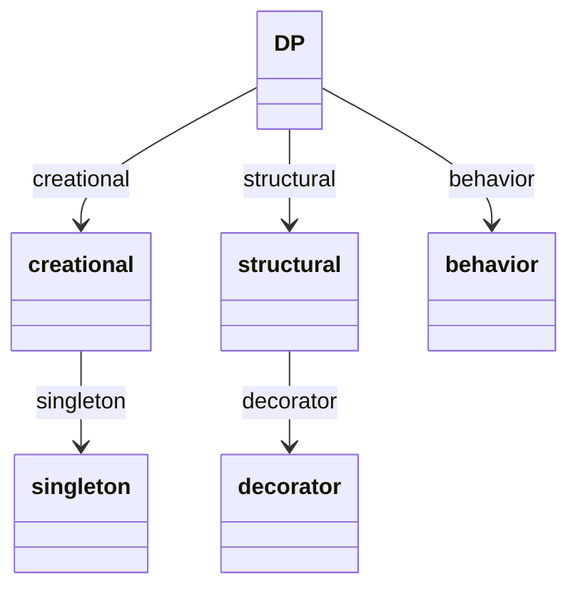
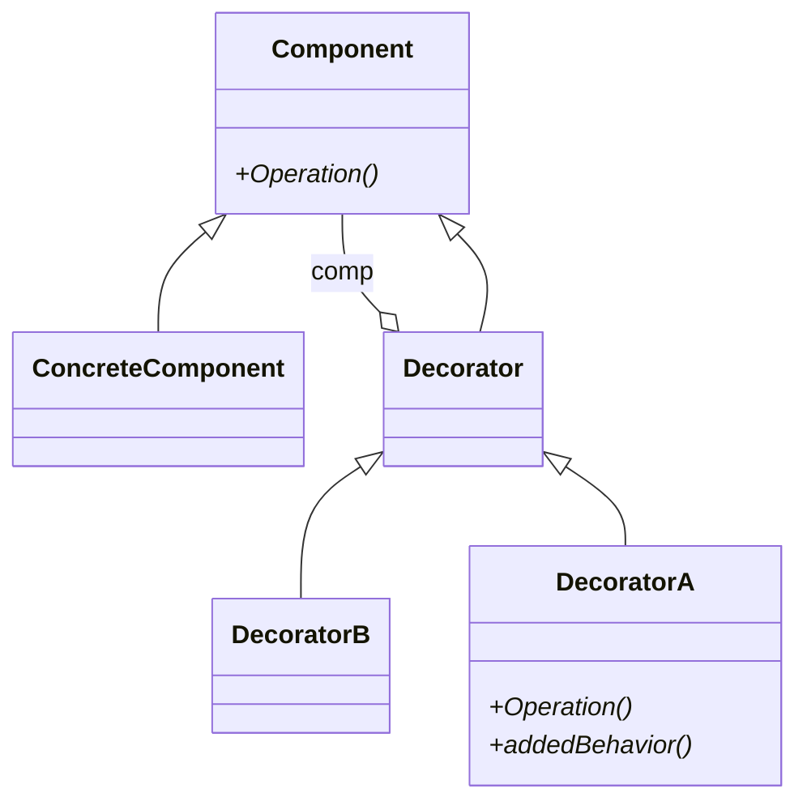
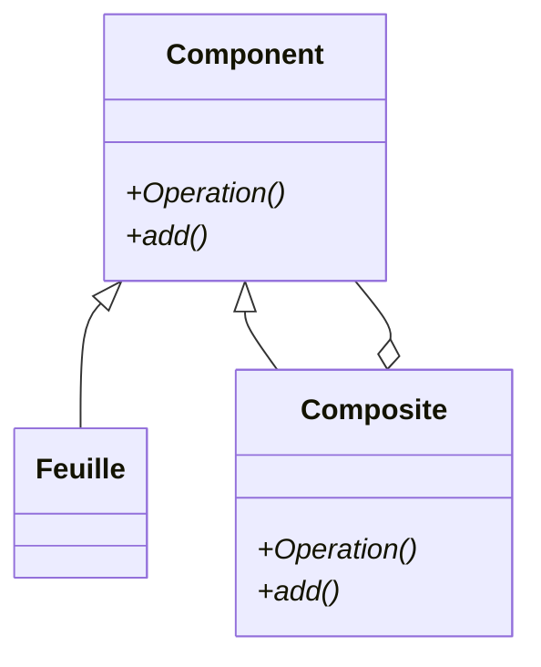

for the fun 

# Contexte

Jeux de test Go

# Options envisagées 💡

# Conseils 
La lecture (même rapide) du livre Design Patterns de Erich Gamma, Richard Helm, Ralph Johnson et John Vlissides

# Décision 🏆
jeux de tests DPO 

# Conséquences 
RAS

Les Design Patterns ci-dessous -->

Design Pattern Object Decorator ci dessous -->

Design Pattern Object Composite ci dessous -->

