# goDesignPatterns

jeux de tests en go sur les designs patterns.
for the fun car golang n'est pas vraiment oriente objet 

Le jeu de test porte sur les design patterns suivants :

## DPO : Singleton 

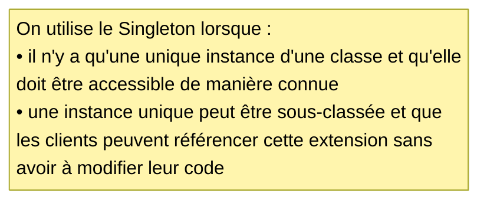

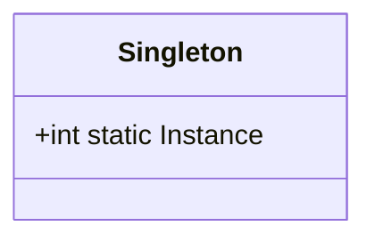
Deux implémentations sont proposées : 
- une implémetation naive
- une implémentation safe 

## DPO : Composite

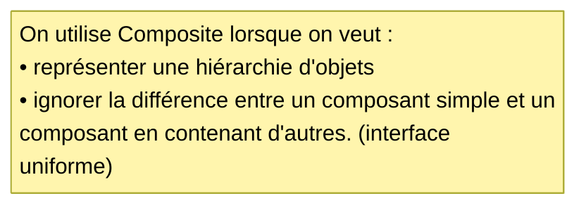

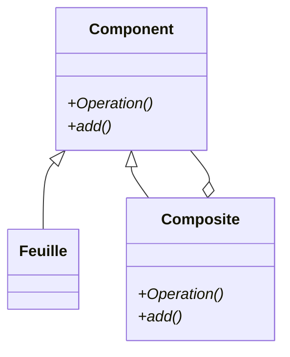

## DPO : Decorator

Design Pattern Object Decorator ci dessous -->

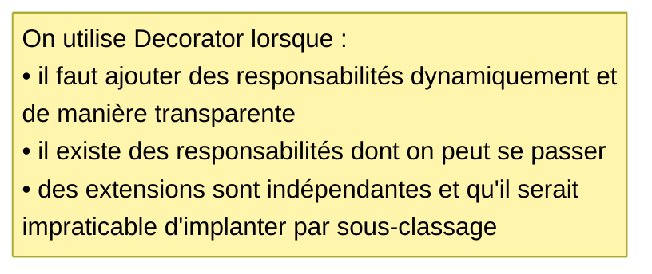

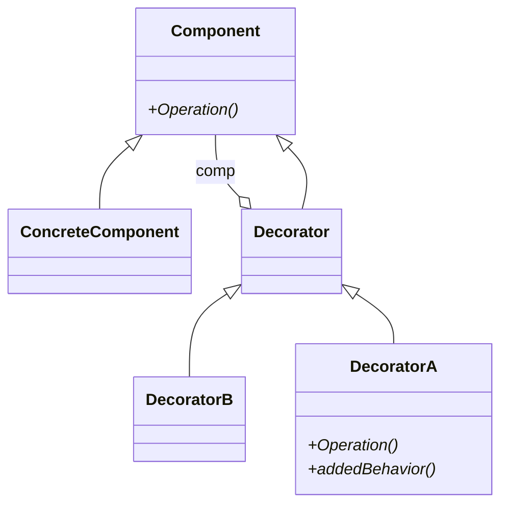

## DPO : Interpreter

Design Pattern Object Interpreter ci dessous -->

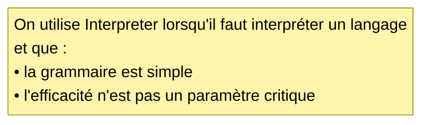

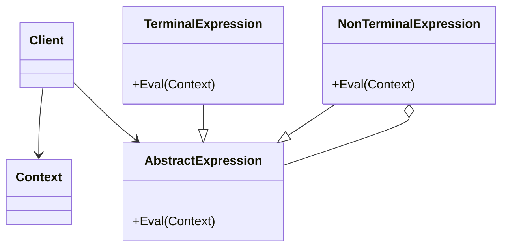

- L'exemple fourni en golang calcule l'expression "3 4 + 2 -" d'où la photo
Vous comprenez que je ne pouvais pas mettre ma Ti58

## DPO : Adapter

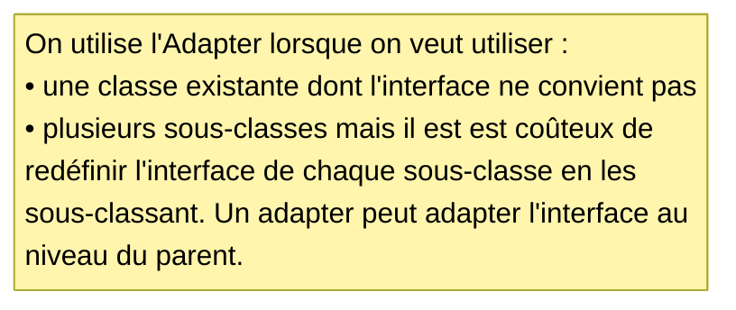

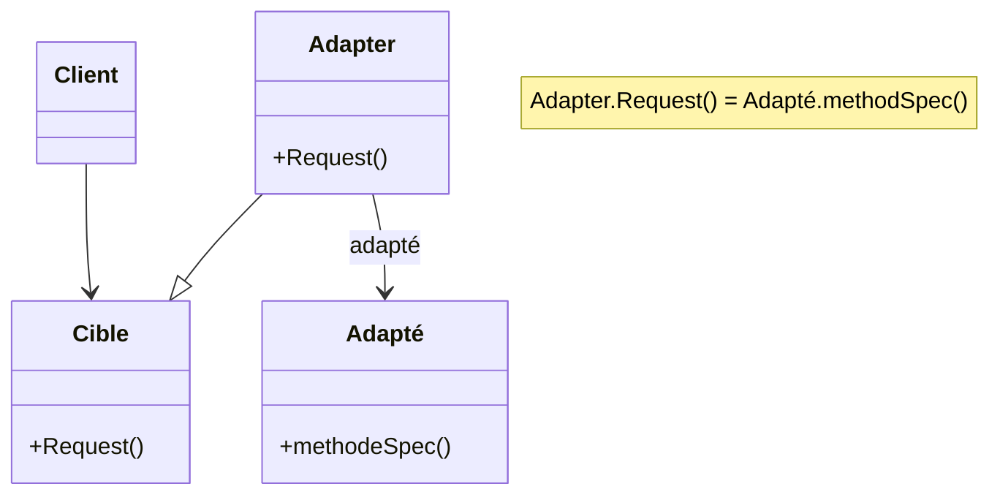

## DPO : Visitor

Design Pattern Object Visitor ci dessous -->
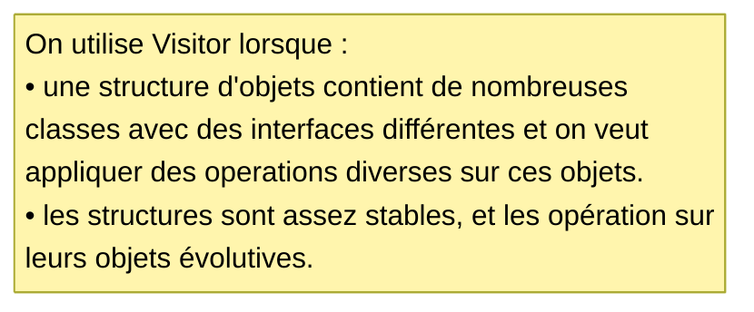

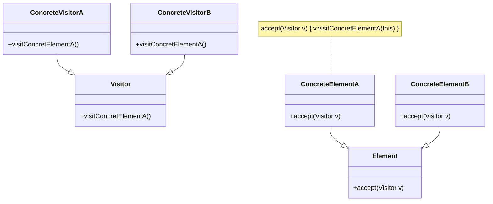

